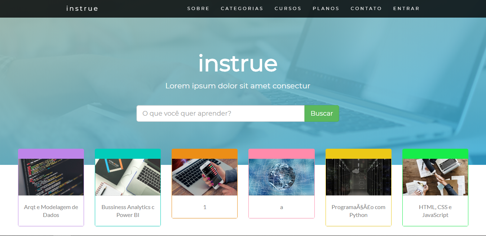
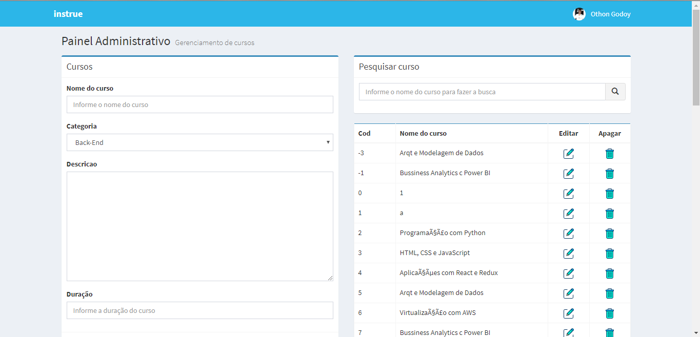

<h1>Projeto instrue FATEC 2019 - BANCO DE DADOS</h1>

Sistema para controle de cursos online.

Ferramentas utilizadas: Eclipse, Gradle, StarUML.

Programação: Java, Javascript-JQuery, HTML, CSS (Bootstrap).

<h3>UML:</h3>

<h3>Home:</h3>

<h3>Login:</h3>

<h3>Admin:</h3>

</small>Author: Rone Felipe Bento e Othon Rafael Godoy<small>
