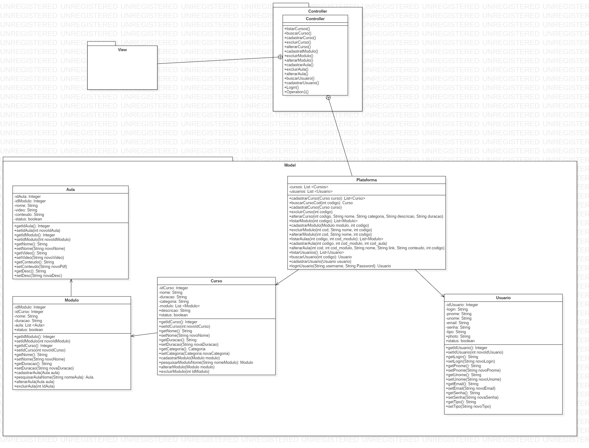

Projeto instrue FATEC 2019 - BBANCO DE DADOS

Sistema para controle de cursos online.

Ferramentas utilizadas: Eclipse, Gradle, StarUML.

Programação: Java, Javascript-JQuery, HTML, CSS (Bootstrap).

UML:

Home:

Login:

Admin:

Author: Rone Felipe Bento e Othon Rafael Godoy
